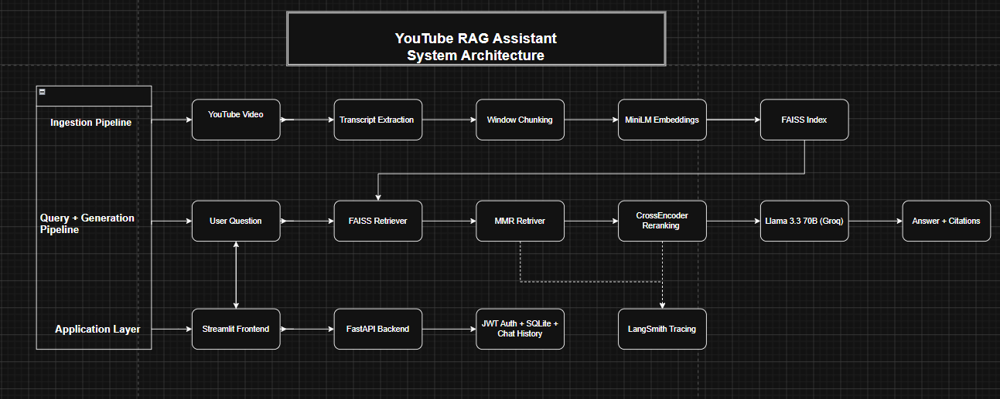
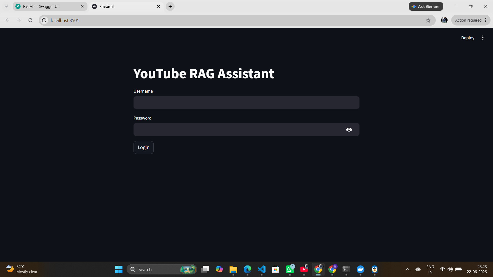
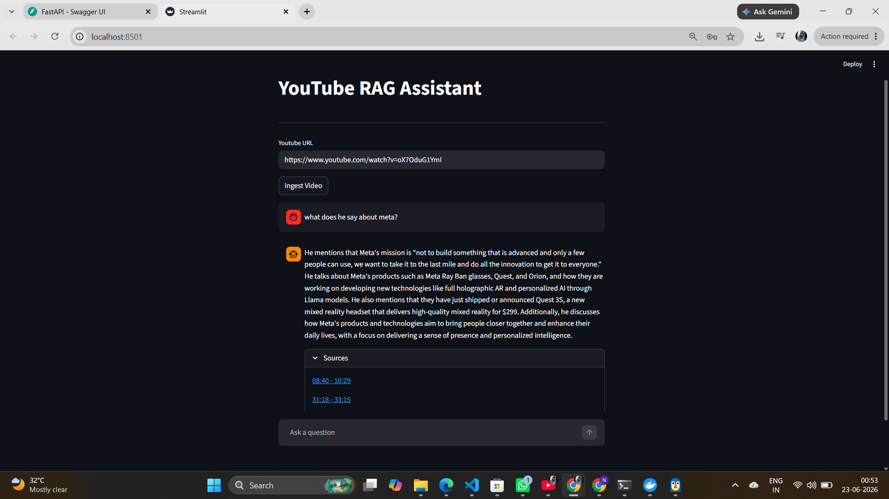
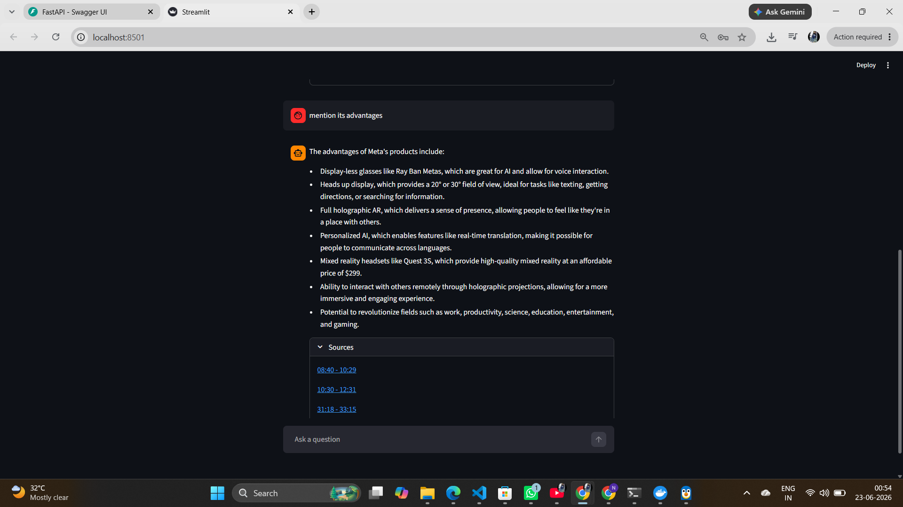
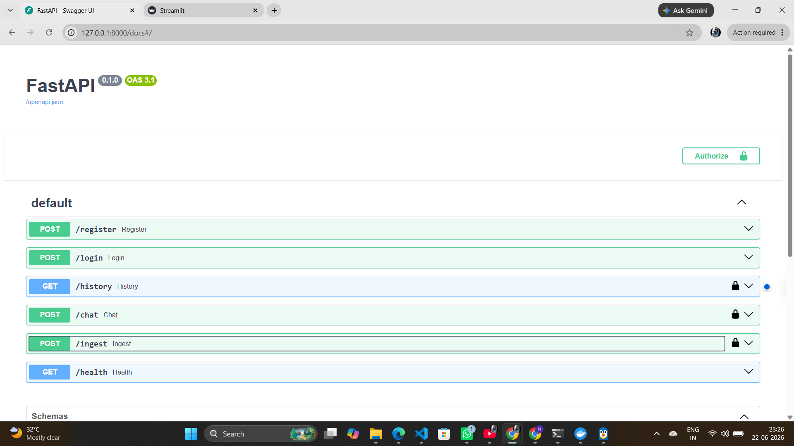

# TubeMind

A Retrieval-Augmented Generation (RAG) system that enables users to chat with YouTube videos using transcript-based semantic search.

The system extracts video transcripts, retrieves relevant context using FAISS + MMR retrieval, reranks results using a CrossEncoder, and generates source-grounded answers with timestamp citations using Llama 3.3 70B through Groq.

The application includes JWT-based user authentication, a FastAPI backend, a Streamlit frontend, and SQLite-powered chat history management that allows users to access their previous conversations across sessions.

---

# 🏗️ System Architecture



---

# 📸 Demo

## Login Interface

JWT-based authentication with user-specific chat history persistence using SQLite.



---


## YouTube Video QA

Transcript ingestion, conversational question answering, and timestamp-grounded citations.



---

## Multi-turn Conversation & Citation Tracking

User-specific chat history stored in SQLite enables conversation continuity across sessions.



---

## Fastapi Backend

Interactive API documentation generated by FastAPI for authentication, ingestion, chat, and history endpoints.



---
#  Features

## RAG Pipeline

- YouTube transcript ingestion
- Window-based chunking with overlap
- Semantic retrieval using FAISS
- MMR (Max Marginal Relevance) retrieval
- CrossEncoder reranking
- Timestamp-grounded citations
- Source-aware answer generation

## User System

- User registration
- User login
- JWT authentication
- Protected endpoints
- User-specific chat history

## Application

- FastAPI backend
- Streamlit frontend
- Dockerized setup
- LangSmith tracing and observability
- Retrieval benchmarking framework

## Database Layer

- SQLite database
- User account management
- Persistent chat history storage
- Conversation retrieval by user

---

# ⚙️ Tech Stack

## Retrieval

- LangChain
- FAISS
- Sentence Transformers
- MMR Retrieval
- CrossEncoder Reranking

## LLM

- Groq
- Llama-3.3-70B-Versatile

## Backend

- FastAPI
- Pydantic
- JWT Authentication

## Frontend

- Streamlit

## Database

- SQLite

## Monitoring

- LangSmith

## Deployment

- Docker

---

---

# 🔌 API Endpoints

## Register User

```http
POST /register
```

Request

```json
{
  "username": "nimey",
  "password": "password123"
}
```

---

## Login User

```http
POST /login
```

Request

```json
{
  "username": "nimey",
  "password": "password123"
}
```

---

## Ingest Video

```http
POST /ingest
```

Request

```json
{
  "url": "https://youtube.com/watch?v=..."
}
```

---

## Chat

```http
POST /chat
```

Request

```json
{
  "question": "What are AI concerns?"
}
```

---

## Chat History

```http
GET /history
```

---

## Health Check

```http
GET /health
```

---

# 💬 Example Questions

- What are AI concerns discussed in this video?
- Summarize the video.
- What future does the speaker envision for AI?
- What benefits and risks are discussed?
- What are the key takeaways from the video?
- What does the speaker say about Meta?

---

# 📊 Retrieval Evaluation

A qualitative benchmark was conducted to compare different retrieval strategies across representative queries.

## Observations

- CrossEncoder reranking improved precision for highly specific questions.
- MMR retrieval produced more diverse context and reduced redundancy.
- Similarity search often retrieved relevant passages but lacked effective prioritization.
- CrossEncoder reranking introduced additional latency while improving answer quality.

## Example Findings

| Query Type | Best Performing Method |
|------------|-----------------------|
| Entity-specific Questions | MMR + CrossEncoder |
| Broad Summarization | MMR |
| General Factual Retrieval | MMR / CrossEncoder |

## Latency Comparison

| Retrieval Method | Average Latency |
|------------------|----------------|
| Similarity Search | ~0.02s |
| MMR Retrieval | ~0.03s |
| MMR + CrossEncoder | ~0.50s |

## Key Insight

The evaluation highlighted a tradeoff between retrieval quality and latency.

MMR retrieval improved contextual diversity, while CrossEncoder reranking improved precision for highly targeted questions at the cost of additional retrieval time.

---

# 🧠 Why FastAPI + Streamlit?

FastAPI and Streamlit serve different purposes.

### FastAPI

Responsible for:

- Authentication
- Transcript ingestion
- Retrieval pipeline
- Answer generation
- Chat history management
- REST APIs

### Streamlit

Responsible for:

- User interface
- Video ingestion workflow
- Chat experience
- Citation visualization

This separation creates a cleaner architecture and allows the backend APIs to be reused by other clients such as web applications, mobile apps, or external integrations.

---

# 🔮 Future Improvements

- PostgreSQL migration
- Hybrid Retrieval (BM25 + Dense Retrieval)
- Multi-video knowledge bases
- Streaming responses
- Automated evaluation using RAGAS
- Multi-user vector stores
- Multimodal RAG using video frames and transcripts

---

# 🛠️ Installation

## Clone Repository

```bash
git clone https://github.com/your-username/youtube-rag-system.git
cd youtube-rag-system
```

## Install Dependencies

```bash
pip install -r requirements.txt
```

## Configure Environment Variables

Create a `.env` file:

```env
GROQ_API_KEY=your_key

LANGCHAIN_API_KEY=your_key
LANGCHAIN_PROJECT=youtube-rag
LANGCHAIN_TRACING_V2=true
```

---

## Run FastAPI

```bash
uvicorn main:app --reload
```

Swagger UI:

```text
http://127.0.0.1:8000/docs
```

---

## Run Streamlit

```bash
streamlit run frontend/app.py
```

Streamlit UI:

```text
http://localhost:8501
```

---
